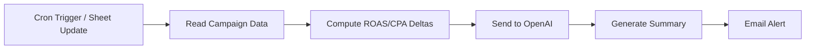

# 🚨 AI Agent Demo: Campaign Performance Alert with n8n + OpenAI

This is a quick demo of a lightweight AI agent built using [n8n](https://n8n.io), Google Sheets, OpenAI, and Gmail — designed to detect performance drops in ad campaigns and automatically send a natural-language alert to your inbox.

🧠 **Built in ~15 minutes. Saves hours every week.**

---

## 🎥 Demo Walkthrough (2-min Loom)
👉 [Watch the demo](https://www.loom.com/share/ac0835733d7a4dfa82ebdcfabe5940c8?sid=9928698f-e0b1-407d-804f-71ebca137ea8)

---

## 💡 What It Does

- **Ingests** campaign data (e.g., ROAS, CPA, CTR) from Google Sheets  
- **Analyzes** changes over time to detect performance drops  
- **Summarizes** the insight using OpenAI (GPT-4) in plain English  
- **Sends** a formatted alert to your email or Slack — automatically  

It turns a manual campaign performance check into a 100% automated daily task — and can be extended to plug directly into Google Ads, Meta, Looker Studio, Airtable, or Notion.

---

## 🛠️ Stack

| Tool        | Purpose                         |
|-------------|---------------------------------|
| `n8n`       | Workflow automation + orchestration |
| `Google Sheets` | Simulated campaign data source |
| `OpenAI GPT-4` | Natural language alert summary |
| `Gmail`     | Alert delivery (Slack optional)  |

---

## 📦 Why This Matters

Marketing and growth teams spend hours each week:
- Manually reviewing campaign performance  
- Writing team updates or performance reports  
- Copying data across tools just to stay on top of what’s working

With an AI agent like this, you can:
✅ Detect problems faster  
✅ Reduce manual monitoring  
✅ Improve internal visibility — without adding to your workload  

---

## 🧩 Agent Architecture (Simplified)

---

## 🚀 Quick Wins, Real Value

This agent:
- Took ~15 minutes to build
- Can be extended to multiple campaigns
- Can run daily, hourly, or on update
- Saves 1–2 hours/week per account manager

Multiply that across clients, and the impact grows fast.

---

## 🧭 What's Next?

This is just the beginning. From here, we can:
- Plug into Google Ads or Meta APIs directly
- Automate campaign QA, creative generation, reporting summaries
- Build a full internal suite of agents for your ops, marketing, and client comms teams

---

## 👋 Interested in building your own AI agents?

This demo shows how quickly we can turn repetitive workflows into automated systems that save time, reduce errors, and unlock strategic bandwidth.

If you're exploring AI adoption for your team — let’s chat.

—  
👤 **Built by Mark Torres**  
AI Systems Builder | Workflow Automator | LLM + API Specialist
---
